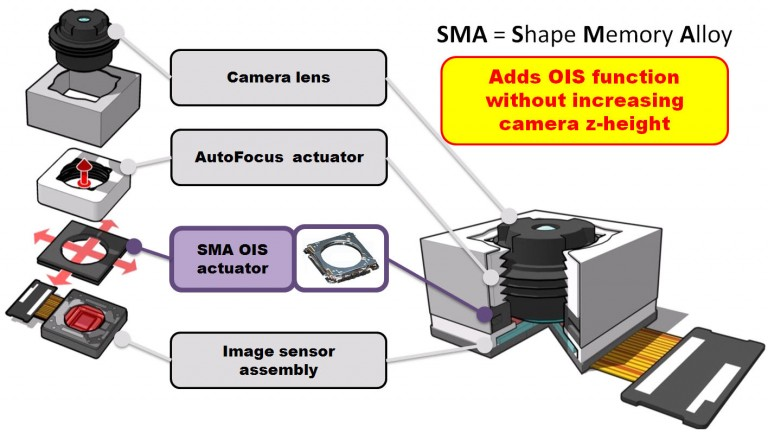

手机中实现OIS光学防抖的方式有三种：悬丝式、滚珠式和SMA式。
其中悬丝式的结构如下面两张图。可以看到镜头周围有金属丝，这个金属丝有两个用处：1、给镜组线圈供电以实现自动对焦；2、金属丝相当于弹簧，起到一定的限位作用。具体到产品上iPhone 7就采用了悬丝式。不过由于悬丝式对于镜组的重量有要求，过重的镜组会和模组的其他部分产生过大的摩擦力，导致难以移动。在行业内也有称呼这种方式为“弹片式”的，主要是相关部件造型略有不同，但原理还是相近的；
滚珠式OIS和悬丝式OIS的不同主要在于滚珠式的镜组是不通电的，且镜组和相机模组的其他部分没有直接连接，完全靠外部线性马达线圈移动整个镜组来完成对焦和光学防抖——所以诺基亚也把这个结构称之为”浮动镜组”。同时为了减少镜组和相机模组其他部分的摩擦，所以采用滚珠作为镜组的支撑。
滚珠式的问题在于体积比较大，加上模组不通电的时候镜组受到的约束有限，所以晃动的时候镜组会撞到相机模组的其他部分发出声音。

SMA（shape memory alloy 记忆合金）式OIS的历史就比较短了，直到华为P30 Pro这代才开始运用到手机上。它的基本原理是使用形状记忆合金来替代前两种方案中的线性马达作为OIS的驱动马达。不过SMA马达不能像线性马达一样提供两个方向上的力，所以SMA马达一般还需要搭配一组弹簧用于提供另一个方向上的修正力矩。
SMA式OIS的最大优势就是体积要比滚珠式小，同时由于不需要线性马达，所以SMA式OIS不需要考虑磁干扰——这可以更为容易地实现机背上两个甚至多个摄像头都具有OIS功能。目前SMA式的挑战主要还是在于响应速度和对温度的敏感性上。

SMA（Shape Memory Alloy）是一种可以记忆形状的金属，当温度达到记忆温度以上时，会恢复原来的形状。

目前手机常用的防抖方式有两种：

EIS电子防抖
使用最简单的方法，只要看不到抖动就没有抖。

一般手机拍的画面，边缘抖动会更大，电子防抖就是将边缘的画面去掉，这样让画面的抖动幅度看起来变得更小。
OIS光学防抖
能在上下、左右、前后三个方向模拟鸡的头的作用，但是幅度比较小，若不在这三个方向就不能进行防抖。

举个简单的例子，不是万向轮的箱子，只能往固定的方向拉，换个方向拉起来就很费劲。

OIS光学防抖只能做到镜头平移和镜头倾斜的平面移动，也就是X轴、Y轴的平面移动，防抖角度换算约为正负1°，其实防抖范围很有限，而去年开始流行的EIS电子防抖是通过软件算法进行画面裁切，并没有物理方式的防抖，会造成一定画幅和画质的损失。

即便大到IMX700和GN1这种尺寸，但是和全画幅比还是小的可怜。所以SoC厂商、CMOS厂商和终端厂商最近一年都在潜心研究Ai技术对影像系统的实质性作用。这个方向是对的，但是有风险，最大的风险就是过度依赖计算导致的影像失真和数码痕迹过重。我甚至有时候觉得，只要SoC够强，完全依赖计算摄影的时代里，什么OIS都没必要，反正手机自己能算。

微云台的工作原理：
微云台机构由限位机构、双滚珠悬架、镜头、音圈马达、双S型FPC排线、T-FPC、磁动力框架、模组载架以及保护盖构成，既要达到量产，也要足够薄，否则搞成个板砖没人愿意用。vivo使用了磁动力框架来解决云台机构的小型化问题：

EIS电子防抖：不能减少实际抖动，会裁切画面；

OIS光学防抖：小幅度减少实际抖动，受方向限制；

微云台防抖：大幅度减少实际抖动，无方向限制。

目前来看，“微云台”依然存在着结构复杂、体积较大、成本较高的问题。